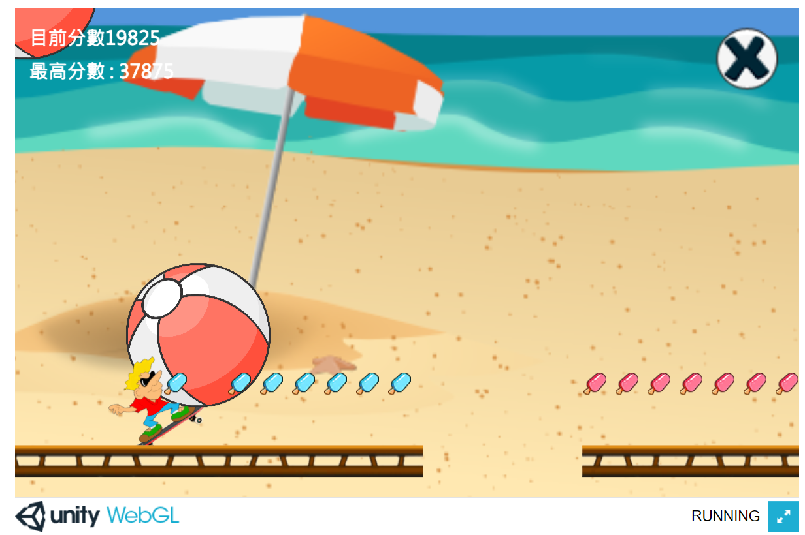

# RunCool
2D跑酷小遊戲
點擊滑鼠左鍵:加速;右鍵:跳躍
## 目錄
* [介紹](#介紹)
* [遊戲截圖](#遊戲截圖)
* [網頁遊玩](#網頁遊玩)
* [未實現功能](#未實現功能)
* [聯繫](#聯繫)

## 介紹
將程式課程內容作變化，並增加想實現的遊戲性
1.增加完成度
2.場景切換
3.增加關卡變化
4.生成超級道具
5.SuperTime的加分機制及加速時間
6.切換關卡時會紀錄並延續上個關卡分數

## 遊戲截圖

# Code Examples

## 網頁遊玩
https://yoyo1012.github.io/RunCool/
## 未實現功能
1.SuperTime時有無敵效果
2.磁鐵道具
3.增加關卡及過關成就
## 聯繫
see0864792888@gmail.com
